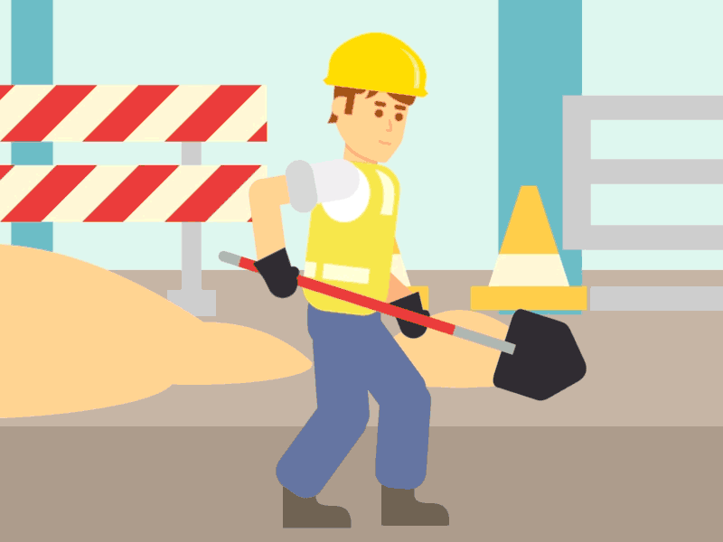
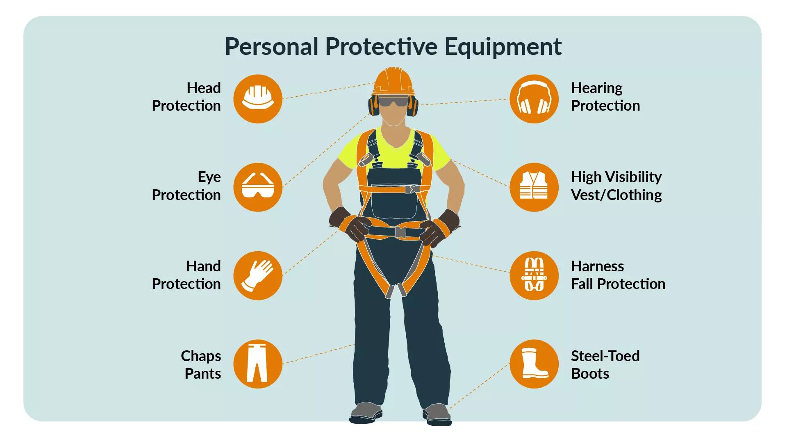
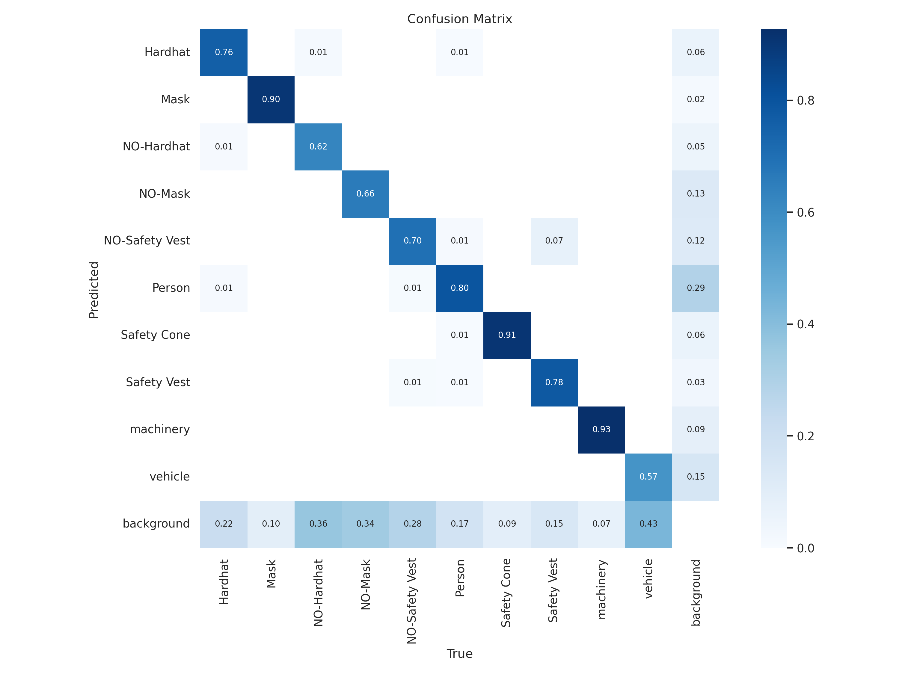
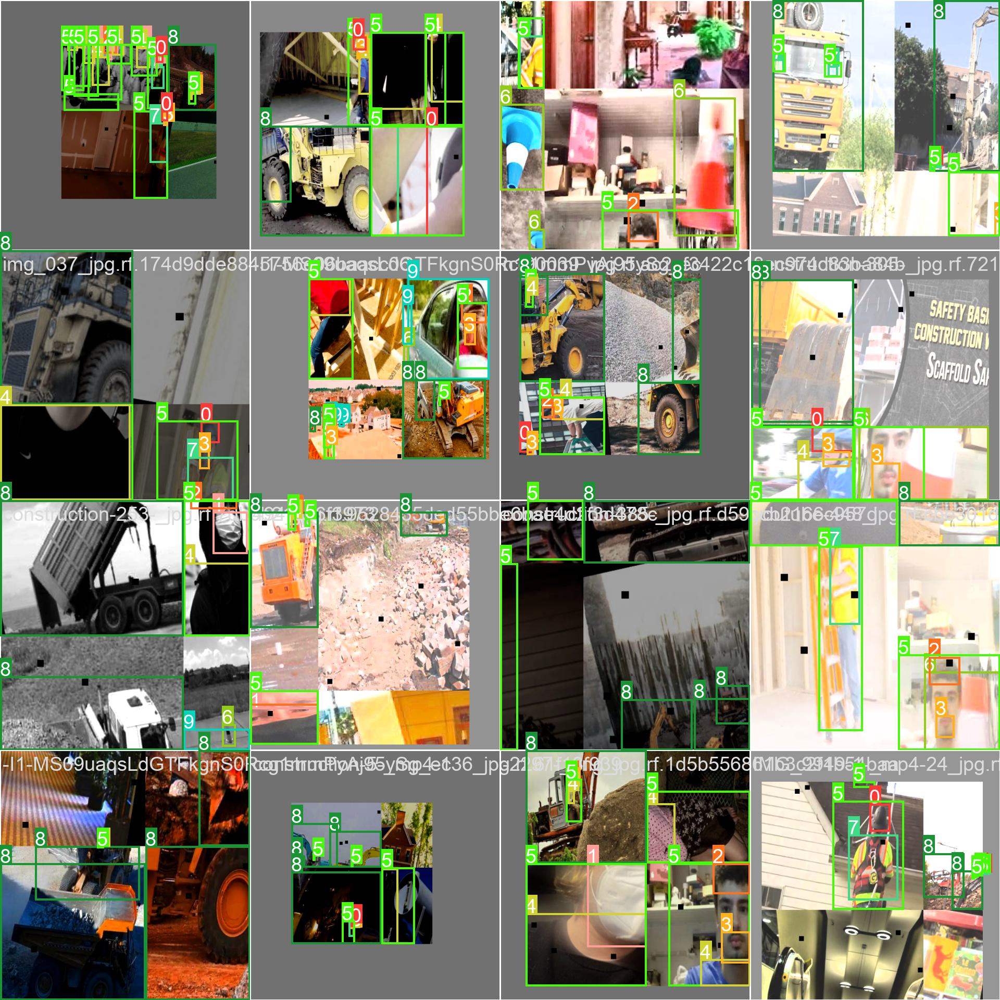
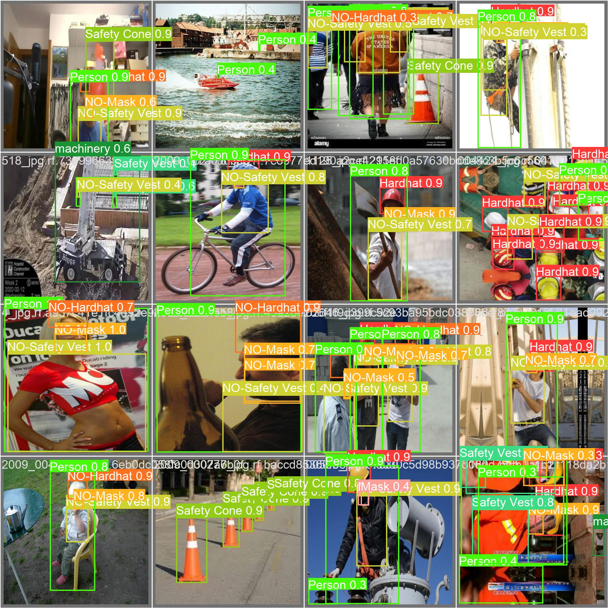
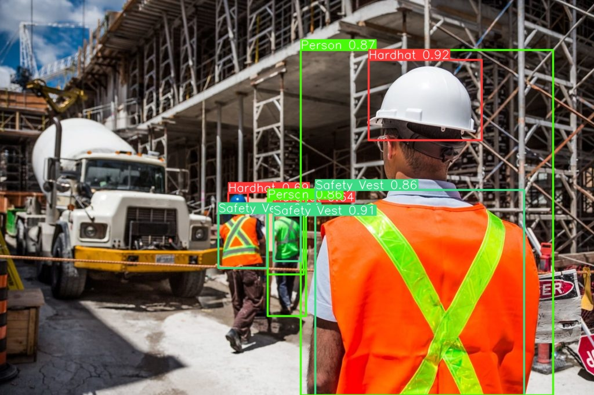
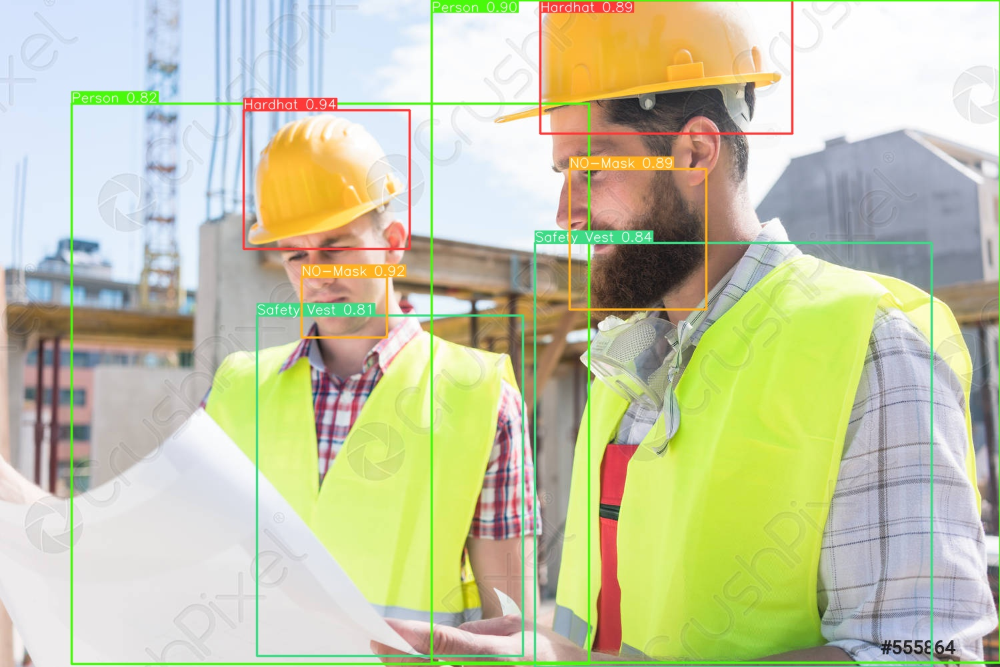

# PPE Detection for Construction Site Safety using YoloV8

> 4,764 workers died on the job in 2020 (3.4 per 100,000 full-time equivalent workers). Workers in transportation and material moving occupations and construction and extraction occupations accounted for nearly half of all fatal occupational injuries (47.4 percent), representing 1,282 and 976 workplace deaths, respectively. 
>
> *Occupational Safety and Health Administration (US Department of Labour)*


## Introduction

There have been various accidents in construction sites, due to the lack of safety equipments for workers. The aim of this project was to detect PPE on a worker, which can be further used for tracking and triggerring alarm (safety monitoring) in future. We use the dataset provided by Roboflow on [**Construction Site Safety Image Dataset**](https://universe.roboflow.com/roboflow-universe-projects/construction-site-safety). 

For easier use the dataset is already uploaded here: [**Kaggle Dataset**](https://www.kaggle.com/datasets/snehilsanyal/construction-site-safety-image-dataset-roboflow).

The dataset consists of 2801 image samples with labels in YoloV8 format. These images are split into `train: 2605`, `valid: 114` and `test: 82` sets. Each folder consists of `images` and `labels` folders.

There are 10 classes to detect from the dataset: 

**'Hardhat', 'Mask', 'NO-Hardhat', 'NO-Mask', 'NO-Safety Vest', 'Person', 'Safety Cone', 'Safety Vest', 'machinery', 'vehicle'**





## Setup

The code was run on Kaggle, with a P100 GPU. We installed the `ultralytics` library by [**Ultralytics**](https://docs.ultralytics.com) to run YoloV8 custom object detection on the dataset.

For more information check out this notebook: [**Check yo'self before you wreck yo'self - CSS EDA**](https://www.kaggle.com/code/snehilsanyal/check-yo-self-before-you-wreck-yo-self-css-eda). 

**Note:** This repository contains all the results, visualizations and best model after custom training on the dataset.

## File Hierarchy

1. `data` folder consists of the yaml file required for training. It also contains 3 folders `train`, `valid` and `test`. Each of these folders have 2 subfolders `images` (with .jpg files) and `labels` (with .txt annotations).
2. `results` folder consists of the prediction results of the model, confusion matrix plot, visualizations of the train and valid batches and PR curves.
3. `models` folder consists of 2 models, `yolov8n.pt` which is the pre-trained model on COCO128.yaml and `best.pt` which is the custom trained yolov8n model on our dataset.
4. `source_files` folder consists of videos and images for evaluation of our custom trained model.
5. `output` folder consists of output produced by our custom object detection model after 100 epochs of training.


## Code

```
├───.ipynb_checkpoints
├───assets
├───data
├───├──data.yaml
├───├──ppe_data.yaml
│   ├───test
│   │   ├───images
│   │   └───labels
│   ├───train
│   │   ├───images
│   │   └───labels
│   └───valid
│       ├───images
│       └───labels
├───models
├───output
│   └───output_yolov8n_100e
├───results
└───source_files
```

## Results

The training of YoloV8n model was done for 100 epochs and was completed in 2.719 hours. After training, we get the following results:








## Outputs




## Future Work

1. Train the model for more epochs.
2. Compare with 4 other models by YoloV8.
3. Create ID tracking of workers and save bounding boxes of workers not wearing proper PPE.
4. ML App deployment with alarm trigerring.
